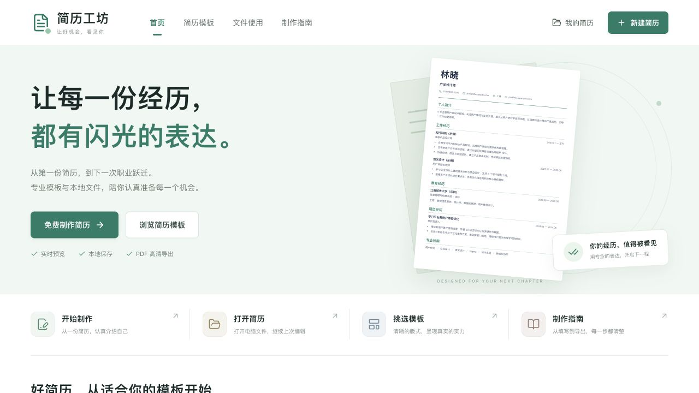
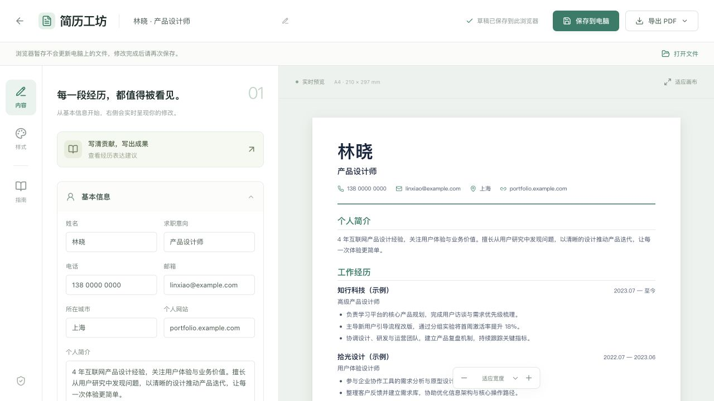

<div align="center">

<h1>简历工坊</h1>
<p><strong>认真写下经历，为下一次机会做好准备。</strong></p>
<p>选择模板 · 实时编辑 · 保存到电脑 · 下次继续</p>

<p>
  
  
  
  
</p>

<p>
  <a href="#界面预览">界面预览</a> ·
  <a href="#快速开始">快速开始</a> ·
  <a href="#保存与继续编辑">保存与继续编辑</a> ·
  <a href="#静态部署">静态部署</a> ·
  <a href="#常见问题">常见问题</a>
</p>

</div>

一个无需登录的纯前端简历制作工具。挑选版式、填写经历，右侧纸张随编辑更新；完成后，把可编辑的简历文件留在自己的电脑上。

**简历内容不上传服务器，默认运行无需 Java、数据库或 API 密钥。** 当前尚无公网演示地址，可按下方步骤在本地运行。

## 产品亮点

- **先看效果，再开始写**：独立模板库支持分类、搜索与收藏；放大预览、挑选颜色后进入编辑器。
- **三种版式，六款预设**：经典单栏、左右分栏、现代线条，搭配不同配色；内容与样式可分别调整。
- **修改即时可见**：编辑基本信息、工作、教育、项目和技能，支持经历增删、排序及 A4 实时预览。
- **电脑文件随时接着写**：导出 `.resume.json`，下次打开即可恢复正文、版式和颜色，也能在另一台设备继续编辑。
- **草稿帮助保留进度**：浏览器自动暂存，支持复制、确认移除和短时撤销；存储失败会明确提示。
- **手机也能编辑**：折叠菜单、模板双列和编辑 / 预览切换；投递时可通过浏览器打印生成 PDF。

## 界面预览

### 首页

淡绿首屏与清晰的功能入口，从开始制作、打开文件到挑选模板都能快速进入。



### 编辑与实时预览

左侧整理内容，右侧查看 A4 排版；保存文件与导出 PDF 分别提供入口。



页面截图展示实际界面。模板中的姓名、机构、经历与成果均为虚构示例。

## 快速开始

准备 **Node.js 22.18 或更新版本**及 npm，然后运行：

```bash
git clone https://github.com/ShimenTian/resume-workshop.git
cd resume-workshop
npm ci
npm run dev
```

默认地址为 **http://127.0.0.1:5174**。开发服务器监听本机；端口被占用时，以终端显示的地址为准。

检查生产构建：

```bash
npm run build
npm run preview
```

预览也默认使用 5174 端口，可先停止开发服务器再启动。`npm run preview` 用于本地检查，正式发布请使用静态网站托管。

## 保存与继续编辑

1. **开始填写**：预览并使用模板，或点击“新建简历”从空白开始；将示例替换为真实经历。
2. **保存到电脑**：点击“保存到电脑” → “普通下载”，保留生成的 `姓名.resume.json` 文件。
3. **下次继续**：打开网站，点击“打开简历”或“打开文件”，选择之前保存的文件。
4. **保存新版本**：完成修改后，再次保存到电脑。打开文件会创建新草稿，原有草稿保持不变。

| 保存方式 | 适合什么用途 | 需要记住 |
| --- | --- | --- |
| 浏览器草稿 | 继续当前浏览器中的编辑 | 清除网站数据、换浏览器或换网站地址后，草稿可能不再显示 |
| `.resume.json` 文件 | 保留可编辑版本、换设备继续 | 包含正文、版式与配色；每次修改后需要重新保存 |
| PDF | 投递、打印与分享 | 通过浏览器打印生成；当前不支持重新导入 PDF 编辑 |

> 浏览器暂存不会自动更新电脑里的文件。普通下载后，请在浏览器下载列表确认文件已保存。

支持文件保存对话框的浏览器，还可以选择“选择保存位置”，覆盖原文件或另存一份。取消对话框不会自动下载；普通下载可能生成带编号的新文件。

**导出 PDF**：点击“导出 PDF”，在打印窗口选择“另存为 PDF”。建议使用 A4、100% 缩放，关闭页眉页脚、开启背景图形，并检查分页和联系方式。

## 模板与配色

首页默认展示四款预设，独立模板页展示全部六款。支持简约专业、应届生、商务精英和创意设计分类；搜索、分类与“我的收藏”可组合使用。

| 预设 | 底层版式 | 默认配色 |
| --- | --- | --- |
| 清新 · 经典 | 经典简约 | 绿色 `#167d67` |
| 留白 · 极简 | 经典简约 | 深灰绿 `#303d39` |
| 秩序 · 商务 | 左右分栏 | 蓝灰 `#3e5970` |
| 灵感 · 创意 | 现代线条 | 暖棕 `#a17b45` |
| 初光 · 校园 | 现代线条 | 青绿 `#387b73` |
| 青屿 · 双栏 | 左右分栏 | 灰绿 `#427167` |

六款预设由 **三种版式与不同配色**组合而成。预览时选择的颜色会带入新简历，单纯预览不会创建草稿。收藏记录保留在当前浏览器，不写入简历文件。

## 技术栈与结构

界面使用 **React 19 + TypeScript 5 + Vite 7**，图标来自 Lucide。浏览器草稿使用 `localStorage`，可编辑文件采用 JSON；保存支持普通下载及可用时的文件保存对话框。

```text
src/
├── App.tsx               # 页面路由、模板收藏与文件操作
├── Editor.tsx            # 编辑器与实时预览工作区
├── components/           # 首页、模板库、表单、纸张与弹窗
├── hooks/useResumeStore.ts # 浏览器草稿与存储错误处理
└── lib/                  # 模板目录、文档校验与文件读写
docs/images/              # README 界面截图
design/DESIGN.md           # 界面规格、兼容约束与验收记录
server/                   # 可选的历史 Java 实现
```

首页工具对应实际可用的制作、文件打开、模板和指南功能。当前没有接入 AI 生成、自动润色、云端保存或账户服务。

## 静态部署

执行生产构建，将 **`dist/` 内的完整内容**发布到静态网站托管服务即可。

| 托管配置 | 值 |
| --- | --- |
| 安装命令 | `npm ci` |
| 构建命令 | `npm run build` |
| 发布目录 | `dist` |
| 后端与环境变量 | 默认无需配置 |

项目使用相对资源路径 `base: './'`，可部署到域名根目录或子目录。子目录地址应以 `/` 结尾，例如 `https://example.com/tools/resume/`。

页面采用 hash 路由：`#home`、`#templates`、`#resumes` 和 `#edit/简历标识`，无需额外配置 SPA 路由重写。编辑链接只标识当前浏览器中的草稿；跨设备继续编辑时，请传递简历文件。

建议通过 **HTTPS** 提供访问，以便支持文件保存对话框。普通下载仍作为通用入口。请通过 HTTP / HTTPS 访问页面，直接双击 `dist/index.html` 可能受到浏览器模块加载限制。

## 测试与验证

```bash
npm test
npm run build
```

当前已通过 **30 项前端测试**与生产构建，覆盖文档校验、文件读写和大小边界、取消与失败、浏览器存储异常，以及默认不发起简历网络请求。

本轮浏览器验证覆盖桌面 **1280×720**、手机 **390×844 / 320×740**，包括筛选与收藏、预览配色、编辑面板、真实 JSON 下载后重新打开、刷新恢复，以及草稿复制、移除和撤销。

打印媒体样式已检查；本轮未重新通过系统打印窗口生成 PDF。完整范围与历史分页记录见 [设计与验收说明](design/DESIGN.md#验证记录)。

## 常见问题

<details>
<summary><strong>我的简历存在哪里？浏览器草稿会一直保留吗？</strong></summary>

默认流程只在浏览器中编辑，简历内容不上传服务器。应用仅在你主动选择文件时读取该文件。

草稿按网站来源隔离，即协议、域名和端口的组合；同一来源下的不同子路径共享浏览器存储。清除网站数据、换浏览器、换电脑或换网站来源后，可通过电脑上的文件恢复。当前按单编辑窗口设计，没有跨窗口冲突合并。

浏览器缓存不可用时，当前页面仍可编辑、复制和保存文件；损坏的缓存保持原样，删除失败会保留草稿。出现提示时，请及时保存文件。简历文件为普通 JSON，可能包含联系方式等个人信息，请存放在自己信任的位置。

</details>

<details>
<summary><strong>能打开哪些文件？旧版本简历还能使用吗？</strong></summary>

支持本站生成的 `.resume.json` 与旧版 `.json` 备份，暂不支持 Word、PDF 或其他网站的任意 JSON。文件需要在网站内通过“打开文件”读取，直接双击文件不会自动启动本工具。

单个文件上限为 **2 MiB（2,097,152 字节）**；最多保留 50 份浏览器草稿，每类经历最多 20 条。导入先验证大小、格式和字段，失败时不会覆盖已有草稿。

原有草稿键 `resume-workshop:documents:v1` 与文档结构继续兼容。底层版式仍为 `classic`、`sidebar`、`modern`；模板预设和收藏单独管理，旧文件无需新增字段。更多细节见 [数据和文件兼容](design/DESIGN.md#数据和文件兼容)。

</details>

<details>
<summary><strong>需要启动 Java 服务吗？</strong></summary>

默认开发、构建和静态部署均不需要 Java 或数据库。`server/` 仅保留可选的历史实现，其简历存储 API 默认关闭，也没有多用户身份认证与数据隔离。

如需了解旧版本机 API，请参阅 [Java 服务说明](server/README.md)。本地数据库、个人简历导出和构建产物均由忽略规则排除，不随源码提交。

</details>

---

[界面规格与验收记录](design/DESIGN.md) · [可选 Java 实现](server/README.md) · [GitHub 仓库](https://github.com/ShimenTian/resume-workshop)
